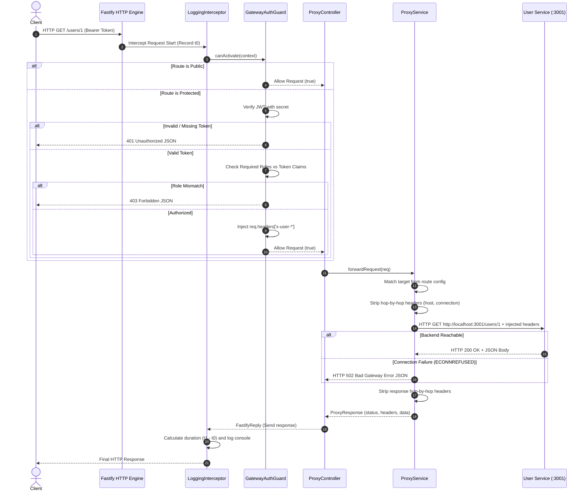

# GateForge Proxy Sequence & Request Flow

This document outlines the detailed sequence diagram and execution steps for every proxied request passing through GateForge.

## Request Flow Sequence Diagram

## Key Architectural Protections

1. **Hop-by-Hop Header Sanitization**: Ensures `host`, `connection`, `transfer-encoding`, and `content-length` are stripped before forwarding so target servers don't misinterpret proxy TCP streams.
2. **Never Throw on Backend Errors**: By setting `validateStatus: () => true` in Axios, 404, 400, or 500 errors returned by downstream services are forwarded directly to the client rather than causing the gateway's HTTP client to throw unhandled exceptions.
3. **Graceful Connection Failures**: If a downstream container/process is offline, GateForge catches network connection errors (`ECONNREFUSED`, `ENOTFOUND`) and returns a standardized `502 Bad Gateway` JSON response.
